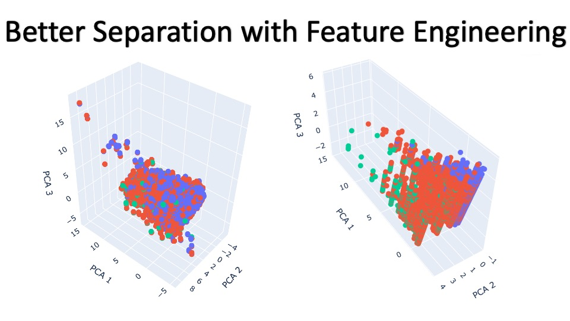

# 🏥 Hospital Stay Length Prediction

## 📊 Project Overview

Predicting the length of a hospital stay is critical for effective hospital resource management, enhancing patient care, and reducing costs. This project focuses on using machine learning techniques to predict the length of stay for patients based on various clinical and demographic data. Understanding and accurately predicting how long a patient is likely to stay in the hospital can help optimize healthcare operations, improve patient outcomes, and contribute to the overall efficiency of healthcare systems.

### 🎯 Why This Matters
Hospital resources are often constrained, and any inefficiencies can lead to longer patient stays, higher costs, and reduced quality of care. By leveraging predictive analytics, hospitals can better allocate resources, reduce wait times, and ultimately improve patient satisfaction. This project aims to create a model that accurately predicts hospital stay lengths, ensuring that healthcare institutions can plan better and offer timely care to their patients.

## 🗂️ Dataset
The dataset contains clinical information such as blood work, vital signs, and diagnoses. It includes the following features:
- **Patient demographics**: gender, number of readmissions, etc.
- **Clinical data**: blood urea nitrogen, glucose levels, and several binary flags indicating the presence of conditions such as asthma, renal failure, and others.
- **Hospital operational data**: admission date, discharge date, length of stay, facility ID, etc.

The dataset consists of 100,000 rows and 28 columns, with no missing values, making it a robust source for building predictive models.

## 🛠️ Project Steps
1. **Data Loading and Cleaning**: 
   - Loaded and cleaned the dataset, performing one-hot encoding for categorical variables such as gender and hospital facility.
   - Verified no missing values across all features.

2. **Exploratory Data Analysis**: 
   - Analyzed distributions, correlations, and outliers.
   - Used histograms and heatmaps to understand data patterns and relationships between clinical indicators and hospital stay length.

3. **Feature Engineering**: 
   - Created new features, including a transformed readmission count (rcount) and aggregate clinical flags.
   - Categorical variables were encoded to enhance the machine learning models.
  


4. **Modeling**: 
   - Built multiple machine learning models using Random Forest for regression and classification tasks.
   - Used cross-validation to evaluate model performance and optimized hyperparameters.
   - Achieved a mean squared error of 0.72 and an R-squared of 0.87 in regression tasks. For classification, a final accuracy of 94% was achieved after tuning the model.

5. **Results and Insights**: 
   - Important predictors for hospital stay length were identified, including the number of readmissions, certain blood markers, and facility ID.
   - The project demonstrated that using these clinical and demographic features, it is possible to predict hospital stay lengths with reasonable accuracy.

## ⚙️ How to Use the Code
1. Clone the repository:
   ```bash
   git clone https://github.com/your-repo/hospital-stay-length-prediction.git
   ```
2. Install the required dependencies:
   ```bash
   pip install -r requirements.txt
   ```
3. Run the Jupyter notebook to explore the data and see the model training process:
   ```bash
   jupyter notebook HospitalStayPrediction.ipynb
   ```

## ✅ Conclusion
This project showcases the power of machine learning in healthcare to predict hospital stay lengths, which can have a significant impact on the efficiency of hospitals and patient outcomes. By providing these predictions, hospitals can make informed decisions regarding staffing, bed management, and patient care, ultimately benefiting both healthcare providers and patients.
